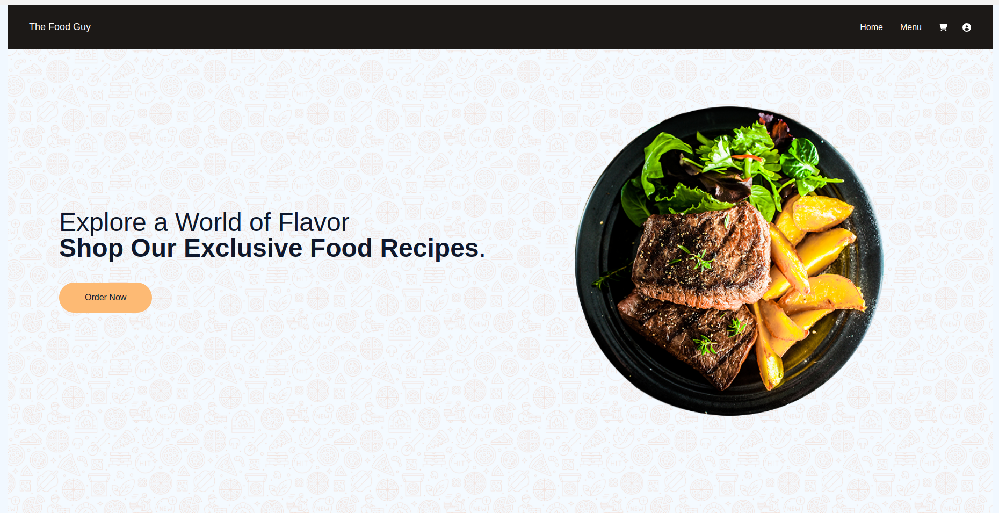
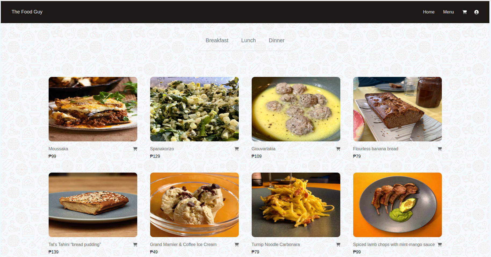

# The Food Guy

Welcome to the The Food Guy! This is a web application that allows you to explore, purchase, and enjoy a wide variety of delicious food recipes. Powered by Redux Toolkit, Tailwind CSS, ReactJS and connected to a versatile API, our platform offers a seamless experience for discovering and managing your favorite recipes.

## Features

- **Recipe Discovery:** Explore an extensive collection of recipes from various cuisines, dietary preferences, and difficulty levels.

- **Recipe Details:** Get detailed information for each recipe, including ingredients, preparation time, and nutritional facts.

- **Purchase Recipes:** Buy your favorite recipes for convenient access anytime, anywhere.

- **User-Friendly Interface:** Our user-centric design ensures a smooth browsing experience on both desktop and mobile devices.

- **Redux-Powered State Management:** Efficiently manage application state, providing a seamless experience to users.

<!-- ## Demo

Check out the live demo of the Livre De Cuisine Website: [Demo Link](https://www.cookingstepwebsite.com) -->

## Screenshots

### Home Page

### Menu Page

## Installation

1. Clone the repository: `git clone https://github.com/miggy-pg/the-food-guy`
2. Navigate to the project directory: `cd the-food-guy`
3. Install dependencies: `npm install`

## Usage

1. Run the application: `npm start`
2. Open your browser and go to: `http://localhost:5173`
3. Explore and enjoy cooking!

## Technologies Used

## Contributing

Contributions are welcome! If you'd like to contribute to the Livre De Cuisine website, please follow these steps:

1. Fork the repository.
2. Create a new branch: `git checkout -b feature/your-feature-name`
3. Make your changes and commit them: `git commit -m "Add some feature"`
4. Push to your forked repository: `git push origin feature/your-feature-name`
5. Create a pull request.

## Contact

Feel free to reach out to me via email at phillip.mgalan@gmail.com or connect with me on [LinkedIn](https://www.linkedin.com/in/migui-galan/).
